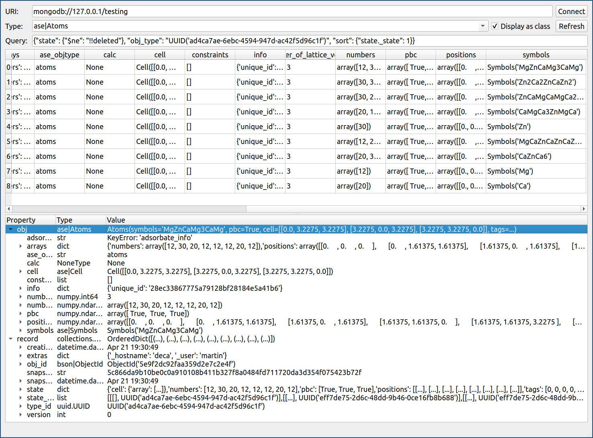

.. _`mincePy`: https://mincepy.readthedocs.io/en/latest/index.html

mincePy
=======

.. image:: https://codecov.io/gh/muhrin/mincepy_gui/branch/develop/graph/badge.svg
    :target: https://codecov.io/gh/muhrin/mincepy_gui
    :alt: Coverage

.. image:: https://travis-ci.com/muhrin/mincepy_gui.svg?branch=master
    :target: https://travis-ci.com/github/muhrin/mincepy_gui
    :alt: Travis CI

.. image:: https://img.shields.io/pypi/v/mincepy_gui.svg
    :target: https://pypi.python.org/pypi/mincepy_gui/
    :alt: Latest Version

.. image:: https://img.shields.io/pypi/wheel/mincepy_gui.svg
    :target: https://pypi.python.org/pypi/mincepy_gui/

.. image:: https://img.shields.io/pypi/pyversions/mincepy_gui.svg
    :target: https://pypi.python.org/pypi/mincepy_gui/

.. image:: https://img.shields.io/pypi/l/mincepy_gui.svg
    :target: https://pypi.python.org/pypi/mincepy_gui/

A GUI for browsing and manipulating `mincePy`_ data.

